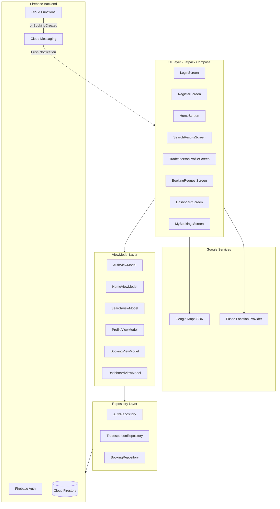
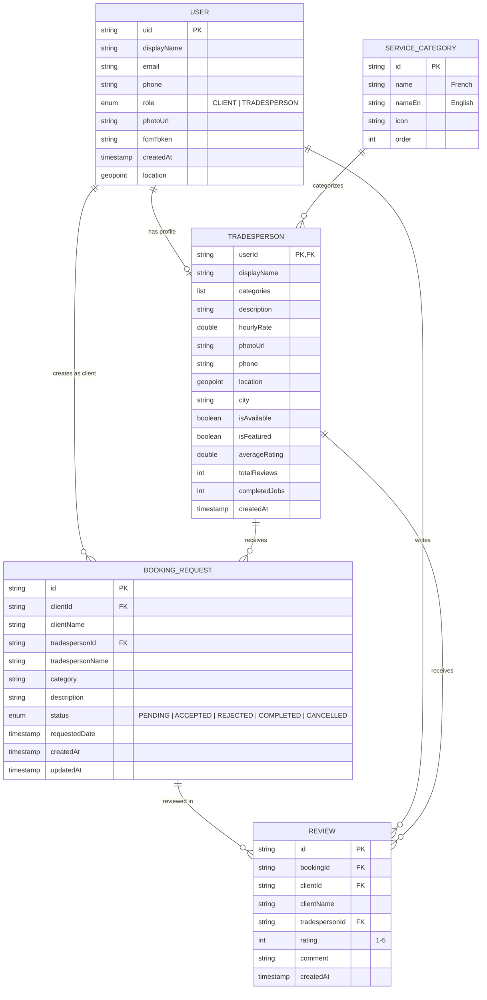
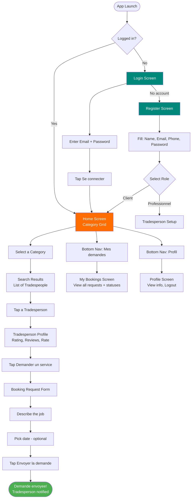
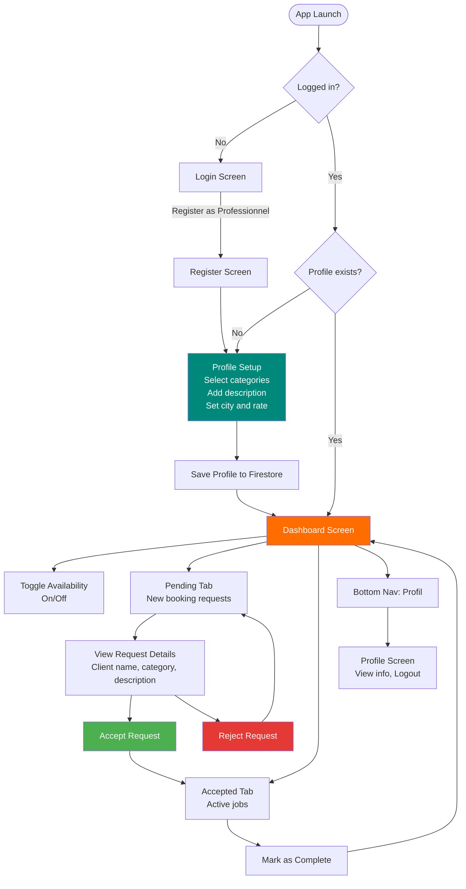
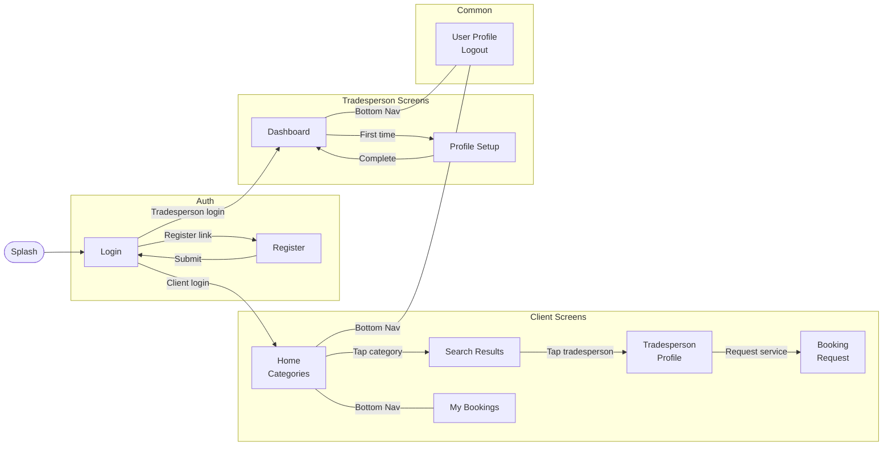
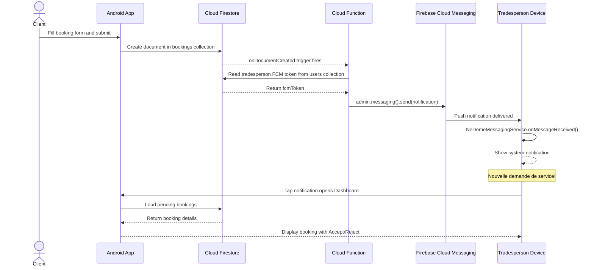

# Ne Deme - Architecture Document

> **Living document** — update this file whenever architectural decisions change.
> Last updated: 2026-04-19

## Table of Contents

1. [Overview](#1-overview)
2. [System Architecture](#2-system-architecture)
3. [Data Model](#3-data-model)
4. [User Flows](#4-user-flows)
5. [Navigation Map](#5-navigation-map)
6. [Notification Flow](#6-notification-flow)
7. [Monetization](#7-monetization)
8. [Firebase Security Rules](#8-firebase-security-rules)
9. [Project Structure](#9-project-structure)
10. [Changelog](#10-changelog)

---

## 1. Overview

**Ne Deme** is an Android marketplace app that connects tradespeople (plumbers, electricians, gardeners, etc.) with homeowners and anyone needing home services. The app targets the West African market with a French-language UI and FCFA currency.

### Tech Stack

| Layer | Technology | Purpose |
|-------|-----------|---------|
| UI | Kotlin + Jetpack Compose | Declarative native Android UI |
| Architecture | MVVM + Hilt DI | Separation of concerns, testability |
| Navigation | Compose Navigation | Single-activity, route-based navigation |
| Auth | Firebase Authentication | Email/password login and registration |
| Database | Cloud Firestore | NoSQL document database, real-time listeners |
| Notifications | Firebase Cloud Messaging + Cloud Functions | Push notifications on booking creation |
| Maps | Google Maps Compose + Play Services Location | Map view, location picker, distance calculations |
| Image Loading | Coil | Async image loading for profile photos |

### Two User Roles

- **Client** — browses categories, searches for tradespeople, sends booking requests, tracks request status, leaves reviews
- **Tradesperson (Professionnel)** — registers a service profile, receives push notifications for new requests, accepts/rejects bookings, marks jobs as complete

---

## 2. System Architecture

The app follows a layered MVVM architecture with Firebase as the backend-as-a-service (BaaS). There is no custom server — all backend logic runs on Firebase services, with one Cloud Function for push notification delivery.



### Layer Responsibilities

| Layer | Responsibility | Key Pattern |
|-------|---------------|-------------|
| **UI** | Render composables, capture user input, observe state | `collectAsStateWithLifecycle()` |
| **ViewModel** | Hold UI state, orchestrate use cases, expose `StateFlow<UiState>` | `MutableStateFlow` + `viewModelScope` |
| **Repository** | Abstract data sources, execute Firestore queries, return `Flow<Resource<T>>` | `callbackFlow` with snapshot listeners |
| **Firebase** | Persist data, authenticate users, deliver notifications | Firestore, Auth, FCM, Cloud Functions |

### Dependency Injection

Hilt provides all dependencies via two modules:

- **`AppModule`** (`di/AppModule.kt`) — provides singleton Firebase instances: `FirebaseAuth`, `FirebaseFirestore`, `FirebaseMessaging`
- **`RepositoryModule`** (`di/RepositoryModule.kt`) — provides singleton repositories: `AuthRepository`, `TradespersonRepository`, `BookingRepository`

### Resource Wrapper

All async operations return `Resource<T>` (`util/Resource.kt`):

```kotlin
sealed class Resource<out T> {
    data class Success<T>(val data: T) : Resource<T>()
    data class Error(val message: String) : Resource<Nothing>()
    data object Loading : Resource<Nothing>()
}
```

---

## 3. Data Model

### Entity Relationship Diagram



### Firestore Collections

| Collection | Document ID | Purpose |
|------------|------------|---------|
| `users` | Firebase Auth UID | User profiles, FCM tokens, role |
| `tradespeople` | userId (= Auth UID) | Service provider profiles, ratings, availability |
| `bookings` | Auto-generated | Booking requests and status tracking |
| `categories` | Admin-defined (e.g., `plumbing`) | Pre-seeded service categories (read-only) |
| `reviews` | Auto-generated | Client reviews and ratings for tradespeople |

### Pre-seeded Categories

| ID | French | English | Icon |
|----|--------|---------|------|
| `plumbing` | Plomberie | Plumbing | `water_drop` |
| `electrical` | Electricite | Electrical | `bolt` |
| `gardening` | Jardinage | Gardening | `yard` |
| `cleaning` | Nettoyage | Cleaning | `cleaning_services` |
| `painting` | Peinture | Painting | `format_paint` |
| `carpentry` | Menuiserie | Carpentry | `carpenter` |
| `masonry` | Maconnerie | Masonry | `construction` |
| `hvac` | Climatisation | HVAC | `ac_unit` |

### Booking Status Lifecycle

```
PENDING → ACCEPTED → COMPLETED
    ↓         ↓
 REJECTED  CANCELLED
```

---

## 4. User Flows

### 4.1 Client User Flow



**Key steps:**
1. Client logs in or registers with the **Client** role
2. Home screen shows a grid of 8 service categories
3. Tapping a category queries Firestore for available tradespeople in that category
4. Search results are sorted: **Featured first**, then by **average rating** (descending)
5. Client views a tradesperson's profile (reviews, rating, rate, description)
6. Client fills out a booking request form (description + optional date)
7. On submission, a Firestore document is created and a push notification is sent to the tradesperson
8. Client can track booking status in "My Bookings"

### 4.2 Tradesperson User Flow



**Key steps:**
1. Tradesperson registers with the **Professionnel** role
2. On first login, completes profile setup: select service categories, write description, set city and hourly rate
3. Dashboard shows two tabs: **Pending** (new requests) and **Accepted** (active jobs)
4. Can **accept** or **reject** pending requests
5. Can **mark jobs as complete** from the accepted tab
6. Can **toggle availability** on/off — when off, they don't appear in search results

---

## 5. Navigation Map



### Screen Routes

| Route | Screen | ViewModel | Role |
|-------|--------|-----------|------|
| `login` | LoginScreen | AuthViewModel | Both |
| `register` | RegisterScreen | AuthViewModel | Both |
| `home` | HomeScreen | HomeViewModel | Client |
| `search_results/{category}` | SearchResultsScreen | SearchViewModel | Client |
| `tradesperson_profile/{tradespersonId}` | TradespersonProfileScreen | ProfileViewModel | Client |
| `booking_request/{tradespersonId}/{category}` | BookingRequestScreen | BookingViewModel | Client |
| `my_bookings` | MyBookingsScreen | MyBookingsViewModel | Client |
| `dashboard` | TradespersonDashboardScreen | DashboardViewModel | Tradesperson |
| `tradesperson_setup` | TradespersonSetupScreen | TradespersonSetupViewModel | Tradesperson |
| `profile` | UserProfileScreen | — (uses AuthViewModel state) | Both |

### Bottom Navigation

**Client**: Home | Mes demandes | Profil

**Tradesperson**: Dashboard | Profil

---

## 6. Notification Flow

The only server-side code is a single Cloud Function (`functions/src/index.ts`) that sends push notifications when a booking is created.



### FCM Token Lifecycle

Tokens are managed in three places:

1. **`AuthRepository.register()`** — gets initial token, stores in user document
2. **`AuthRepository.login()`** — refreshes token on each login
3. **`NeDemeMessagingService.onNewToken()`** — handles token rotation by updating Firestore

### Notification Payload

```json
{
  "notification": {
    "title": "Nouvelle demande de service !",
    "body": "{clientName} a besoin d'un service de {category}"
  },
  "data": {
    "bookingId": "{bookingId}",
    "type": "new_booking"
  }
}
```

---

## 7. Monetization

### Model: Freemium with Featured Listings

| Tier | Cost | Benefits |
|------|------|----------|
| **Free** | 0 FCFA | Listed in search results, receive bookings |
| **Premium** | TBD FCFA/month | Featured badge, **priority placement** in search results |

### How it works

The `Tradesperson` model has an `isFeatured: Boolean` field. The search query sorts results by `isFeatured DESC` first, then by `averageRating DESC`:

```kotlin
// TradespersonRepository.searchByCategory()
firestore.collection("tradespeople")
    .whereArrayContains("categories", category)
    .whereEqualTo("isAvailable", true)
    .orderBy("isFeatured", Query.Direction.DESCENDING)  // Featured first
    .orderBy("averageRating", Query.Direction.DESCENDING) // Then by rating
```

**MVP approach**: The `isFeatured` flag is set manually in Firebase Console after mobile money payment. No in-app payment processing needed for launch.

**Phase 2 planned**: In-app subscription via Google Play Billing, commission per completed booking (5-10%).

### Visual indicator

Featured tradespeople display a gold `WorkspacePremium` icon badge in both `TradespersonCard` and `TradespersonProfileScreen`.

---

## 8. Firebase Security Rules

```
firestore.rules
```

| Collection | Read | Write | Notes |
|------------|------|-------|-------|
| `users` | Authenticated | Own document only | All users can read other profiles |
| `tradespeople` | Authenticated | Own document only | Create + update restricted to owner |
| `bookings` | Client or Tradesperson involved | Client creates; tradesperson updates `status` and `updatedAt` only | Field-level restriction on updates |
| `categories` | Public | Admin only (disabled) | Pre-seeded, read-only |
| `reviews` | Authenticated | Client who owns the review | `clientId` must match auth UID |

### Required Composite Indexes

- `tradespeople`: (`isAvailable` ASC, `isFeatured` DESC, `averageRating` DESC)
- `bookings`: (`tradespersonId` ASC, `status` ASC, `createdAt` DESC)
- `bookings`: (`clientId` ASC, `createdAt` DESC)

---

## 9. Project Structure

```
ne-deme/
├── app/src/main/java/com/nedeme/
│   ├── MainActivity.kt                    # Single activity, Compose host
│   ├── NeDemeApplication.kt               # @HiltAndroidApp, notification channel
│   ├── data/
│   │   ├── model/                         # Kotlin data classes (Firestore models)
│   │   │   ├── BookingRequest.kt
│   │   │   ├── Review.kt
│   │   │   ├── ServiceCategory.kt
│   │   │   ├── Tradesperson.kt
│   │   │   └── User.kt
│   │   └── repository/                    # Data access layer
│   │       ├── AuthRepository.kt          # Firebase Auth + user CRUD
│   │       ├── BookingRepository.kt       # Bookings CRUD + review submission
│   │       └── TradespersonRepository.kt  # Search, profiles, categories
│   ├── di/                                # Hilt dependency injection
│   │   ├── AppModule.kt                   # Firebase instances
│   │   └── RepositoryModule.kt            # Repository instances
│   ├── service/
│   │   └── NeDemeMessagingService.kt      # FCM push notification handler
│   ├── ui/
│   │   ├── components/                    # Reusable composables
│   │   │   ├── CategoryCard.kt
│   │   │   └── TradespersonCard.kt
│   │   ├── navigation/
│   │   │   ├── NeDemeNavGraph.kt          # All routes and navigation logic
│   │   │   └── Screen.kt                 # Route definitions (sealed class)
│   │   ├── screens/                       # Feature screens (screen + viewmodel)
│   │   │   ├── auth/                      # Login, Register, AuthViewModel
│   │   │   ├── booking/                   # BookingRequest, MyBookings
│   │   │   ├── dashboard/                 # Tradesperson dashboard + setup
│   │   │   ├── home/                      # Category grid
│   │   │   ├── profile/                   # Tradesperson profile, user profile
│   │   │   ├── search/                    # Search results
│   │   │   └── splash/                    # Splash screen
│   │   └── theme/                         # Material3 theme (Color, Type, Theme)
│   └── util/
│       ├── Constants.kt                   # Collection names, notification IDs
│       └── Resource.kt                    # Sealed class for async state
├── functions/                             # Firebase Cloud Functions (TypeScript)
│   └── src/index.ts                       # onBookingCreated → FCM notification
├── firestore.rules                        # Firestore security rules
├── firebase.json                          # Firebase project config
├── build.gradle.kts                       # Project-level Gradle
├── app/build.gradle.kts                   # App-level Gradle (dependencies)
├── gradle/libs.versions.toml              # Version catalog
└── docs/
    └── ARCHITECTURE.md                    # This file
```

---

## 10. Changelog

Track architectural changes here. Add new entries at the top.

| Date | Change | Reason |
|------|--------|--------|
| 2026-04-19 | Google Maps integration | Added map view on search results, location-based search with radius filtering, location picker for tradesperson setup, distance display on cards. New dependencies: Maps Compose, Play Services Maps/Location. New utility: `LocationHelper.kt`. |
| 2026-04-19 | Initial architecture | Greenfield MVP build — Kotlin + Compose + Firebase |
